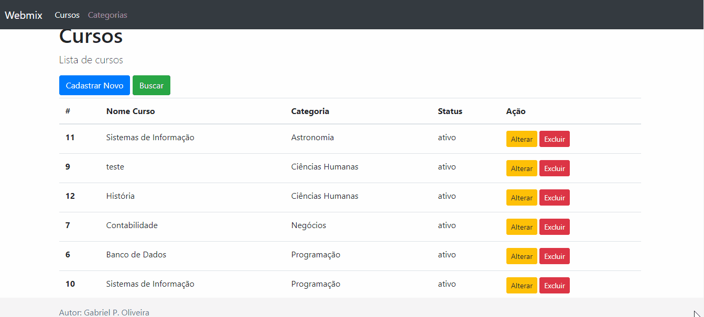
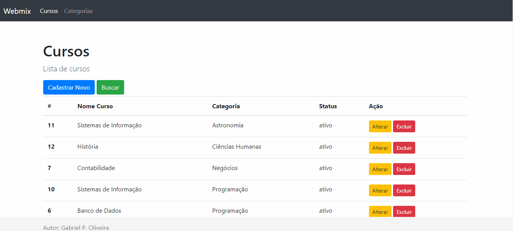
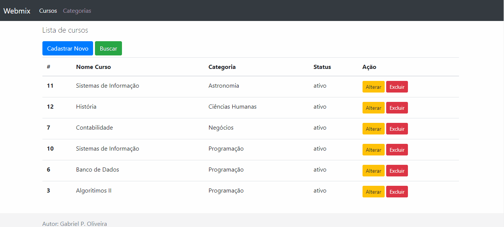

# Challenge Webmix

Esse projeto é um desafio para vaga de programador na Webmix. O desafio consiste em desenvolver um Sistema Básico de Cadastro de Cursos

Desafio:
* O sistema deverá consistir de uma tela inicial, com exibição de cursos cadastrados separados por categoria
* Possuir uma tela para cadastro de categorias de cursos (Categoria, Status)
* Possuir uma tela para cadastro/edição de cursos (Curso, Categoria, Conteúdo, Status)
* Possuir um botão para excluir um curso, exibir um modal com confirmação
* Possuir um campo de busca de cursos usando AJAX (JS)

## Getting Started
### 1. [Download ZIP](https://github.com/GabrielPOliveira/challenge-webmix.git) or Git Clone
```
git clone https://github.com/GabrielPOliveira/challenge-webmix.git
```
### 2. Configurar o banco de dados
```
Na pasta raiz do projeto está o arquivo script.sql para criação das tabelas utilizadas.
```
### Requisites
- CodeIgniter v3.*
- PHP 7.2+
- MySQL
- Não é preciso baixar nenhum pacote npm, os arquivos do bootstrap e jquery foram utilizados via CDN.

###  Melhorias para a próxima versão
 - Ajustar a marcação dos links ativos de menu
 - Melhorar as mensagens de validação
 - Melhorar o sistema de busca.

### Algumas imagens do sistema
- Cursos listagem e cadastro


- Cursos alteração e exclusão



- Busca 



- Categorias





## Authors
* **Gabriel P. Oliveira**
